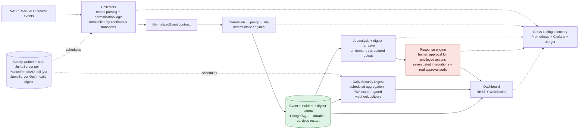

# WardHound

*Tracing enterprise security incidents back to root cause.*


WardHound is a security event correlation, root-cause analysis, and response-orchestration platform for operators working across NAC, PAM, Active Directory, and firewall infrastructure. It turns normalized signals from otherwise separate controls into explainable incidents, deterministic risk scores, and reviewable response requests — and, since its most recent stages, keeps that evidence current on its own: JumpServer and PacketFence are polled continuously through audited PAM-brokered automation, an implemented but live-unconfirmed AD transport follows the same boundary, and a scheduled Daily Security Digest turns the underlying activity into an operator-facing report with PDF export and gated delivery.

> **What this is—and is not:** the deterministic correlation, policy, and risk engines are implemented; collector parsing and normalization are tested against sanitized real-world formats and have been run end-to-end against three real, concurrently live systems; AI analysis is on-demand, typed, and evidence-cited; the React dashboard, REST/WebSocket API, and Prometheus/Grafana/Jaeger observability stack run together. This is not yet a production deployment. JumpServer session/audit polling and PacketFence quarantine polling are both continuously scheduled once their respective configuration signals are present — PacketFence's transport runs entirely through JumpServer's own audited Ops Job API, never a direct PacketFence credential. The equivalent gated Active Directory task is implemented, but successful live delivery through `win_shell` was never observed before lab access ended; the suspected blocker remains the pending cross-VLAN WinRM ACL. Seven external response handlers are simulated by default and become real only when every integration-specific configuration signal and separate real-execution flag is set. The manual-approval handler is different: it reports the real, already-persisted approval identity and timestamp and has no external integration to enable. FMC membership changes remain pending until an operator deploys them to managed devices.

The deliberate split is simple: rules decide what correlates and how risk is scored; AI explains the retained evidence but cannot emit arbitrary commands; a human must approve security-state changes; external mutation is disabled unless its integration-specific safety gate is explicitly satisfied.

## Architecture



Legend: red is safety-gated response behavior that stays simulated until explicit real-execution configuration; green is durable PostgreSQL-backed state. Every scheduled collector task (JumpServer, PacketFence, and AD polling) is itself gated — absent configuration, it logs a skip and makes zero network calls, matching the demo's zero-config behavior exactly. Digest generation is scheduled independently.

## Run the demo

Prerequisites are Docker with Docker Compose and available ports 3000, 3001, 8000, 9090, and 16686.

1. Copy [`.env.example`](.env.example) to `.env`.
2. Replace every required placeholder in that local file. Keep `ANTHROPIC_API_KEY` empty if AI analysis is not needed; do not commit `.env`.
3. Build and start the stack:

   ```bash
   docker compose up --build
   ```

4. Open the dashboard at <http://localhost:3000>. It starts empty until normalized security events are ingested and the correlation pipeline receives a complete evidence chain.

In an authorized lab environment, populate real evidence with the collector bridge scripts for [Active Directory](scripts/ingest_ad_events.py), [PacketFence](scripts/ingest_packetfence_live.py), and [JumpServer](scripts/ingest_jumpserver_live.py). Each script documents its required environment and command-line options. You can also submit normalized events directly through `POST /api/v1/events`; see the interactive [OpenAPI documentation](http://localhost:8000/docs) for the request schema.

Without an Anthropic key, correlated incidents and realtime updates remain available, but the dashboard cannot start its recommendation-driven response workflow because recommendations come from AI analysis. Set `ANTHROPIC_API_KEY` in `.env`, restart the API, open a correlated incident, and explicitly request analysis to invoke the configured Anthropic model. A successful analysis exposes its recommended actions in the dashboard; submitting one creates an audit record. Privileged actions require approval. With no integration settings, every external response remains on its simulation path. PacketFence is real only when `PACKETFENCE_BASE_URL`, `PACKETFENCE_API_TOKEN`, the tenant-specific `PACKETFENCE_ISOLATION_SECURITY_EVENT_ID`, and `PACKETFENCE_REAL_EXECUTION=true` are all set. Active Directory disablement is real only when `AD_LDAP_URL`, `AD_BIND_DN`, `AD_BIND_PASSWORD`, `AD_USER_SEARCH_BASE_DN`, and `AD_REAL_EXECUTION=true` are all set. FMC blocklist membership is real only when `FMC_BASE_URL`, `FMC_USERNAME`, `FMC_PASSWORD`, `FMC_BLOCKLIST_NETWORK_GROUP_ID`, and `FMC_REAL_EXECUTION=true` are all set; an FMC deployment remains an explicit operator responsibility before enforcement. JumpServer termination is real only when `JUMPSERVER_BASE_URL`, `JUMPSERVER_API_TOKEN`, and `JUMPSERVER_REAL_EXECUTION=true` are all set; WardHound confirms `is_finished` after the kill task is accepted. Duo sends and confirms an immediate verification push only when `DUO_API_HOSTNAME`, `DUO_INTEGRATION_KEY`, `DUO_SECRET_KEY`, and `DUO_REAL_EXECUTION=true` are all set; it does not claim to reset all remembered-device sessions. Administrator notification uses a Slack-compatible webhook only when `NOTIFY_WEBHOOK_URL` and `NOTIFY_REAL_EXECUTION=true` are both set. External ticket creation uses a separate vendor-neutral webhook only when `TICKETING_WEBHOOK_URL` and `TICKETING_REAL_EXECUTION=true` are both set, and success requires a non-empty returned `ticket_id`. Treat both webhook URLs as bearer-token credentials: keep them environment-only and never log them. Manual approval needs no integration gate: once `ResponseEngine.approve()` persists the Auth0 principal and decision time, its handler reports that completed checkpoint with `mode=real`. If the Anthropic key is empty, the analysis request returns a clear `503 analysis_not_configured`; deterministic ingestion and incident views remain functional.

This is a **local-config demo**, not a literal no-configuration startup: Compose intentionally refuses to start until the required local database, broker, API-key, and Grafana values referenced by `.env.example` exist. The API key is shared by the frontend and backend and is suitable only for this single-operator environment.

### Continuous collector transports

A separate Celery `worker` and `beat` service run alongside the API. Three collector transports are continuously scheduled, each gated independently and each making zero network calls with no configuration:

- **JumpServer** (`JUMPSERVER_POLL_INTERVAL_SECONDS`, default 300s): polls session and login-log history via JumpServer's AccessKey/HMAC REST API once `JUMPSERVER_BASE_URL`, `JUMPSERVER_ACCESS_KEY_ID`, and `JUMPSERVER_ACCESS_KEY_SECRET` are all set. A Redis-backed UTC watermark makes repeated polling idempotent; a failed cycle retries the same window instead of silently losing activity. See [ADR 0022](docs/adr/0022-jumpserver-continuous-polling.md).
- **PacketFence** (`PACKETFENCE_POLL_INTERVAL_SECONDS`, default 300s): polls quarantine state once `PACKETFENCE_JUMPSERVER_ASSET_NAME` and `PACKETFENCE_JUMPSERVER_RUNAS` are set alongside the JumpServer AccessKey pair above. There is no direct PacketFence credential — the transport runs `pfcmd node view` through JumpServer's own audited Ops Job API, so every command stays inside JumpServer's PAM session/command audit trail. A Redis-backed quarantine snapshot makes repeated polling idempotent and correctly re-alerts if a device leaves and later re-enters quarantine. See [ADR 0024](docs/adr/0024-packetfence-continuous-polling.md).
- **Active Directory** (`AD_POLL_INTERVAL_SECONDS`, default 300s): the implemented task polls Event ID 4625 through JumpServer `win_shell` only when `AD_JUMPSERVER_ASSET_NAME` and `AD_JUMPSERVER_RUNAS` are set alongside the AccessKey pair. It reuses the independently validated Security-log XML extraction and a Redis UTC watermark; these asset identifiers are unrelated to the separate `AD_LDAP_*` disablement credentials. This transport is **implemented but not live-confirmed**: module compatibility was fixed, but no successful end-to-end output was observed before lab access ended, most likely because the pending cross-VLAN pfSense ACL still blocked WinRM. See [ADR 0025](docs/adr/0025-ad-continuous-polling.md), especially “Implemented, but live end-to-end delivery is unconfirmed.”

### Daily Security Digest

A third scheduled task (`DIGEST_SCHEDULE_INTERVAL_SECONDS`, default 86400s) builds a deterministic trailing-24-hour digest — top users by failed authentication, top devices by quarantine/unknown-device activity, incident counts by severity, and response-action approval/execution counts — and persists it to PostgreSQL, with no configuration gate on generation itself. An optional, typed AI executive narrative is layered on top when `ANTHROPIC_API_KEY` is set; narrative failure degrades to a deterministic digest rather than losing the report. Three read endpoints (`POST /api/v1/digests/generate`, `GET /api/v1/digests`, `GET /api/v1/digests/{id}`) plus `GET /api/v1/digests/{id}/pdf` (ReportLab-rendered PDF, no native OS dependencies) are all static-key-gated like the rest of the API. Delivery to an external channel is a separate, independently gated step — `DIGEST_DELIVERY_WEBHOOK_URL` and `DIGEST_DELIVERY_REAL_EXECUTION=true` are both required, and the payload is a bounded JSON summary (digest ID, period, capped executive summary, top-line counts, a link or reference to the PDF) with no raw evidence, entities, or credentials, following the same discipline as the administrator webhook (ADR 0016). See [ADR 0020](docs/adr/0020-daily-security-digest.md) and [ADR 0023](docs/adr/0023-digest-scheduling-and-delivery.md).

### Exposed surfaces

| Surface | Address | Purpose |
| --- | --- | --- |
| Dashboard | <http://localhost:3000> | Incident triage, analysis, and response approvals |
| API / OpenAPI | <http://localhost:8000/docs> | Interactive REST API documentation |
| Grafana | <http://localhost:3001> | Provisioned WardHound operational dashboard |
| Prometheus | <http://localhost:9090> | Metrics scraping and queries |
| Jaeger | <http://localhost:16686> | Distributed trace exploration |
| Raw API metrics | <http://localhost:8000/metrics> | Prometheus scrape endpoint |

`/metrics` is intentionally unauthenticated for private-network Prometheus scraping. Any non-local deployment must isolate it at the network boundary. Grafana, Prometheus, and Jaeger also expose operational security data and require production access controls.

To stop the stack, run `docker compose down`. Incident, event, and digest state is PostgreSQL-backed and survives an API restart; add `--volumes` only when you intentionally want to delete that state along with the local Grafana volume.

### Frontend development

For an independent Vite development server, copy `frontend/.env.example` to `frontend/.env.local`, use the same API key as the backend, then run:

```bash
cd frontend
npm install
npm run dev
```

Frontend quality commands are `npm run lint`, `npm run typecheck`, `npm run test:run`, and `npm run build`.

### Identity setup

Auth0 is optional for viewing incidents and using read/report routes. Without Auth0 configuration,
the static `WARDHOUND_API_KEY` still authorizes normalized event ingestion, incident reads, on-demand
analysis, action-history reads, and realtime WebSocket notifications. Requesting, approving, or
rejecting a response action requires an Auth0 access token.

To enable privileged actions on an Auth0 free-tier tenant:

1. In **Applications → APIs**, create an API named `WardHound API`. Use a URI-style identifier such
   as `https://wardhound-api.example` and keep the signing algorithm at RS256. Enable **RBAC** and
   **Add Permissions in the Access Token**.
2. Add API permissions `request:actions` and `approve:actions`.
3. In **User Management → Roles**, create an `analyst` role with `request:actions`. Create an
   `approver` role with both permissions, then assign test users to the appropriate role.
4. In **Applications → Applications**, create a **Single Page Application** for the React
   dashboard. The Auth0 React SDK is a public browser client and must not use a client secret; a
   Regular Web Application is not appropriate without a server-side backend-for-frontend.
5. Configure Allowed Callback URLs, Allowed Logout URLs, and Allowed Web Origins as
   `http://localhost:3000`. Copy the application Client ID and tenant domain.
6. Set `AUTH0_DOMAIN`, `AUTH0_AUDIENCE`, and `AUTH0_CLIENT_ID` in the root `.env`. Compose passes
   the public values to the frontend as `VITE_AUTH0_DOMAIN`, `VITE_AUTH0_AUDIENCE`, and
   `VITE_AUTH0_CLIENT_ID`. For standalone frontend development, set those `VITE_` values in
   `frontend/.env.local` using `frontend/.env.example` as the template.

The domain value excludes `https://`; the audience must exactly match the API identifier. No Auth0
client secret belongs in either frontend environment or source control. These steps follow Auth0's
[FastAPI API quickstart](https://auth0.com/docs/quickstart/backend/fastapi),
[React SPA quickstart](https://auth0.com/docs/quickstart/spa/react), and
[Core RBAC guidance](https://auth0.com/docs/manage-users/access-control/configure-core-rbac/roles).

## Validation case study

WardHound's collector formats and investigation workflow were validated against sanitized PacketFence NAC, JumpServer PAM, and Active Directory Tiering event data from a mid-sized enterprise Zero Trust engagement. No client identity or production identifier is included in this repository. The concrete evidence chains and outcomes are documented in the [anonymized case study](docs/CASE_STUDY.md).

## Engineering principles and decisions

WardHound keeps deterministic security decisions separate from probabilistic explanation, uses typed immutable contracts between layers, injects infrastructure behind small interfaces, and requires human review before any privileged response. The decision history records the trade-offs:

- [ADR 0001](docs/adr/0001-record-architecture-decisions.md) — recording significant architecture decisions.
- [ADR 0002](docs/adr/0002-event-schema-and-collector-interface.md) — shared event schema, entity model, and collector boundary.
- [ADR 0003](docs/adr/0003-collector-parsing-assumptions.md) — verified PacketFence, JumpServer, and AD parsing formats.
- [ADR 0004](docs/adr/0004-correlation-policy-risk-design.md) — deterministic correlation, policy evaluation, and risk scoring.
- [ADR 0005](docs/adr/0005-ai-analysis-engine-design.md) — structured, on-demand, evidence-cited AI analysis.
- [ADR 0006](docs/adr/0006-response-engine-design.md) — approval workflow and simulation-only response boundary.
- [ADR 0007](docs/adr/0007-incident-api-design.md) — incident API, in-memory stores, static-key auth, and realtime updates.
- [ADR 0008](docs/adr/0008-observability-and-hardening.md) — bounded telemetry, tracing, metrics, and test hardening.
- [ADR 0010](docs/adr/0010-auth0-identity-federation.md) — Auth0 federation, API permissions, and attributable response decisions.
- [ADR 0011](docs/adr/0011-real-packetfence-integration.md) — safety-gated real PacketFence quarantine.
- [ADR 0012](docs/adr/0012-real-active-directory-disable.md) — confirmed, safety-gated Active Directory account disablement.
- [ADR 0013](docs/adr/0013-real-fmc-block-ip.md) — confirmed Cisco FMC blocklist membership with explicit deployment status.
- [ADR 0014](docs/adr/0014-real-jumpserver-close-session.md) — confirmed, safety-gated JumpServer session termination.
- [ADR 0015](docs/adr/0015-real-duo-require-mfa.md) — confirmed, HMAC-signed Duo verification challenges.
- [ADR 0016](docs/adr/0016-real-webhook-notification.md) — safety-gated, data-minimized administrator webhook delivery.
- [ADR 0017](docs/adr/0017-real-ticketing-webhook.md) — confirmed, vendor-neutral external ticket creation.
- [ADR 0018](docs/adr/0018-manual-approval-audit-accuracy.md) — accurate attribution of the already-persisted manual approval checkpoint.
- [ADR 0019](docs/adr/0019-secrets-provider-interface.md) — async secret retrieval seam with unchanged environment-backed behavior.
- [ADR 0020](docs/adr/0020-daily-security-digest.md) — deterministic daily security digest aggregation with optional AI narrative.
- [ADR 0021](docs/adr/0021-real-collector-evidence-ingestion.md) — real collector evidence ingestion validated against three live, concurrent systems.
- [ADR 0022](docs/adr/0022-jumpserver-continuous-polling.md) — continuously scheduled JumpServer polling with a Redis watermark and zero-config network gate.
- [ADR 0023](docs/adr/0023-digest-scheduling-and-delivery.md) — daily digest scheduling, PDF export, and safety-gated webhook delivery.
- [ADR 0024](docs/adr/0024-packetfence-continuous-polling.md) — continuously scheduled PacketFence polling through JumpServer's audited Ops Job API, with AD deliberately excluded pending a network ACL change.
- [ADR 0025](docs/adr/0025-ad-continuous-polling.md) — implemented, gated Active Directory polling through JumpServer Ops, with live end-to-end validation explicitly pending the WinRM network path.

See the [product specification](docs/SPEC.md), [roadmap](docs/ROADMAP.md), and [threat model](docs/THREAT_MODEL.md) for the wider design and explicitly deferred production work.
