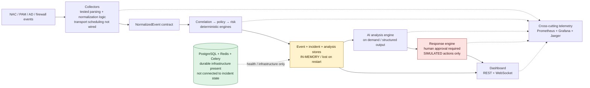

# WardHound

*Tracing enterprise security incidents back to root cause.*

WardHound is a security event correlation, root-cause analysis, and response-orchestration MVP for operators working across NAC, PAM, Active Directory, and firewall infrastructure. It turns normalized signals from otherwise separate controls into explainable incidents, deterministic risk scores, and reviewable response requests.

> **What this is—and is not:** the deterministic correlation, policy, and risk engines are implemented; collector parsing and normalization are tested against sanitized real-world formats; AI analysis is on-demand, typed, and evidence-cited; the React dashboard, REST/WebSocket API, and Prometheus/Grafana/Jaeger observability stack run together. This is not yet a production deployment. Events, incidents, AI analyses, and approvals live in process memory and disappear when the API restarts. Authentication is one shared static API key, collector transports are not continuously scheduled, and every response action is a human-approval-gated **simulation** that records an audit result without changing PacketFence, AD, a firewall, or JumpServer. PostgreSQL, Redis, and Celery run in Compose but are not wired into the main event/incident pipeline.

The deliberate split is simple: rules decide what correlates and how risk is scored; AI explains the retained evidence but cannot emit arbitrary commands; a human must approve security-state changes; simulated handlers never call production control-plane APIs.

## Architecture



Legend: yellow is process-local state, red is simulation-only behavior, and green is durable infrastructure. A green service does not imply that the current incident workflow persists to it.

## Run the demo

Prerequisites are Docker with Docker Compose and available ports 3000, 3001, 8000, 9090, and 16686.

1. Copy [`.env.example`](.env.example) to `.env`.
2. Replace every required placeholder in that local file. Keep `ANTHROPIC_API_KEY` empty if AI analysis is not needed; do not commit `.env`.
3. Build and start the stack:

   ```bash
   docker compose up --build
   ```

4. Open the dashboard at <http://localhost:3000> and choose **Load demo**.

The button creates a fully synthetic AD failure, PacketFence quarantine, and JumpServer session chain in the browser, then submits those already-normalized events through the real correlation, policy, and risk pipeline. It produces a correlated incident without real collector input. Without an Anthropic key, you can inspect the incident and use realtime updates; the dashboard cannot start its recommendation-driven response workflow because recommendations come from AI analysis.

Set `ANTHROPIC_API_KEY` in `.env`, restart the API, open the synthetic incident, and explicitly request analysis to invoke the configured Anthropic model. A successful analysis exposes its recommended actions in the dashboard; submitting one creates an audit record, and privileged actions can then be approved or rejected as simulations. If the key is empty, the analysis request returns a clear `503 analysis_not_configured`; the deterministic incident demo remains functional, but the dashboard path is not fully end to end through analysis and response.

This is a **local-config demo**, not a literal no-configuration startup: Compose intentionally refuses to start until the required local database, broker, API-key, and Grafana values referenced by `.env.example` exist. The API key is shared by the frontend and backend and is suitable only for this single-operator environment.

### Exposed surfaces

| Surface | Address | Purpose |
| --- | --- | --- |
| Dashboard | <http://localhost:3000> | Incident triage, demo loading, analysis, and response approvals |
| API / OpenAPI | <http://localhost:8000/docs> | Interactive REST API documentation |
| Grafana | <http://localhost:3001> | Provisioned WardHound operational dashboard |
| Prometheus | <http://localhost:9090> | Metrics scraping and queries |
| Jaeger | <http://localhost:16686> | Distributed trace exploration |
| Raw API metrics | <http://localhost:8000/metrics> | Prometheus scrape endpoint |

`/metrics` is intentionally unauthenticated for private-network Prometheus scraping. Any non-local deployment must isolate it at the network boundary. Grafana, Prometheus, and Jaeger also expose operational security data and require production access controls.

To stop the stack, run `docker compose down`. Add `--volumes` only when you intentionally want to delete the local PostgreSQL and Grafana volumes; WardHound incident state is already lost whenever the API process restarts.

### Frontend development

For an independent Vite development server, copy `frontend/.env.example` to `frontend/.env.local`, use the same API key as the backend, then run:

```bash
cd frontend
npm install
npm run dev
```

Frontend quality commands are `npm run lint`, `npm run typecheck`, `npm run test:run`, and `npm run build`.

## Validation case study

WardHound's collector formats and investigation workflow were validated against sanitized PacketFence NAC, JumpServer PAM, and Active Directory Tiering event data from a mid-sized enterprise Zero Trust engagement. No client identity or production identifier is included in this repository. The concrete evidence chains and outcomes are documented in the [anonymized case study](docs/CASE_STUDY.md).

## Engineering principles and decisions

WardHound keeps deterministic security decisions separate from probabilistic explanation, uses typed immutable contracts between layers, injects infrastructure behind small interfaces, and requires human review before any privileged response. The decision history records the trade-offs:

- [ADR 0001](docs/adr/0001-record-architecture-decisions.md) — recording significant architecture decisions.
- [ADR 0002](docs/adr/0002-event-schema-and-collector-interface.md) — shared event schema, entity model, and collector boundary.
- [ADR 0003](docs/adr/0003-collector-parsing-assumptions.md) — verified PacketFence, JumpServer, and AD parsing formats.
- [ADR 0004](docs/adr/0004-correlation-policy-risk-design.md) — deterministic correlation, policy evaluation, and risk scoring.
- [ADR 0005](docs/adr/0005-ai-analysis-engine-design.md) — structured, on-demand, evidence-cited AI analysis.
- [ADR 0006](docs/adr/0006-response-engine-design.md) — approval workflow and simulation-only response boundary.
- [ADR 0007](docs/adr/0007-incident-api-design.md) — incident API, in-memory stores, static-key auth, and realtime updates.
- [ADR 0008](docs/adr/0008-observability-and-hardening.md) — bounded telemetry, tracing, metrics, and test hardening.

See the [product specification](docs/SPEC.md), [roadmap](docs/ROADMAP.md), and [threat model](docs/THREAT_MODEL.md) for the wider design and explicitly deferred production work.
